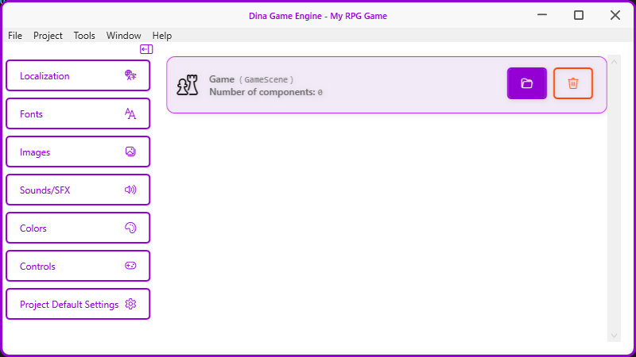
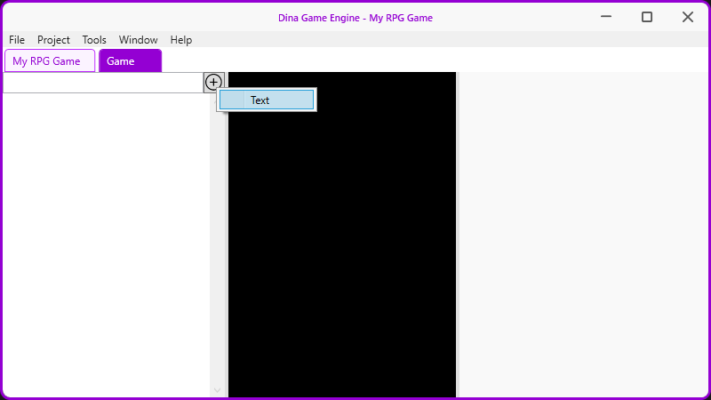
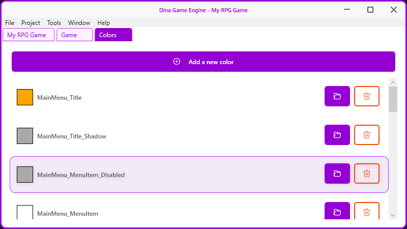
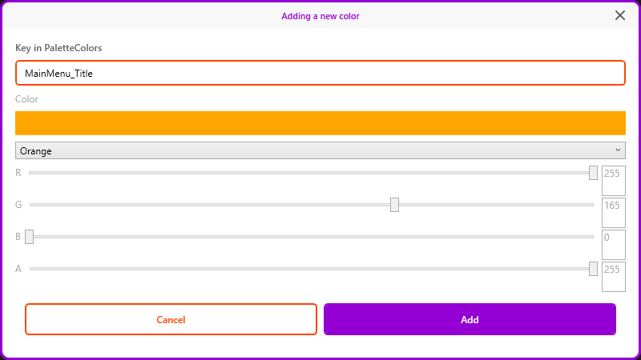
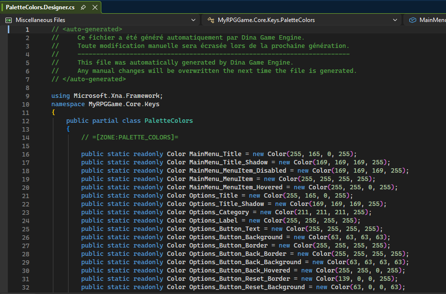
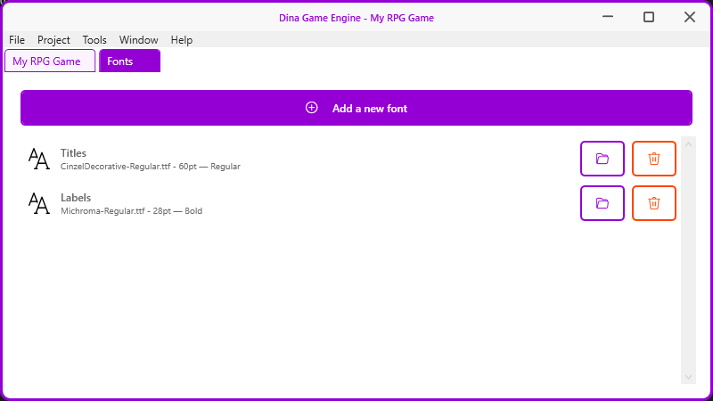
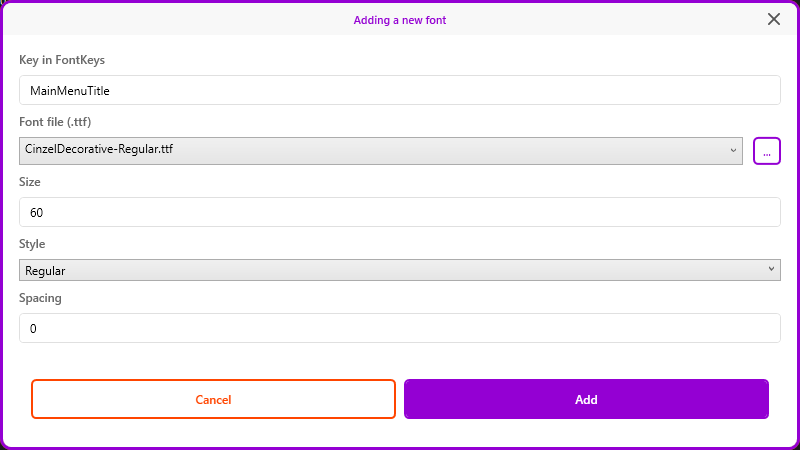

# Dina Game Engine

**A visual 2D game editor for C# developers — powered by MonoGame and DinaCSharp**

---

## What is Dina Game Engine?

**Dina Game Engine** is a visual editor designed for C# developers who want to create 2D games with [MonoGame](https://www.monogame.net/) and the [DinaCSharp](https://dinacsharp.lacombedominique.com) framework — without giving up control of their code.

The editor generates clean, structured C# code that stays fully editable in Visual Studio. No black box, no lock-in.

Built with **WPF / .NET 10**, targeting **Windows only**.

---

## 🚀 Zero to playable in seconds

When you create a new project, Dina Game Engine generates a **100% functional Visual Studio solution** that compiles and runs immediately — no setup required.

Out of the box, your game includes:

| Feature | Details |
|---|---|
| 🎮 Main menu | Navigation between scenes, fully wired |
| ⚙️ Options screen | Resolution, fullscreen mode, master/music/SFX volume |
| 🔤 Font system | Multi-resolution SpriteFont support |
| 🔊 Audio system | Sound and music management |
| 🖼️ Asset system | Image and sprite resource management |
| 🌍 Localization | Multi-language support out of the box |

> Just hit **Run** in Visual Studio — your game is already alive.

---

## ✨ Editor Features (v0.7.0)

- **Project management** — Create, open, and manage game projects. Recent projects grouped by date with icons, path, last access time, and pin support.
- **Scene editor** — Add and filter scene components. Component type selector via contextual add menu. Scene preview panel is work in progress.
- **Color palette management** — Add, edit, and delete named colors. Changes are automatically reflected in `PaletteColors.Designer.cs` in the game project.
- **Font management** — Add, edit, and delete named fonts with TTF file selection. Multi-resolution SpriteFont files are automatically generated for all supported resolutions (720p to 2160p) with proportional size calculation. Changes are reflected in `FontKeys.Designer.cs` and `FontContent.mgcb`.
- **Code generation** — Partial class system separating auto-generated Designer files from user-editable files. Zone markers ensure safe incremental updates without overwriting user code.
- **Multi-view navigation** — Tab bar with closable tabs for working across multiple editors simultaneously.
- **Localization** — The editor is currently available in French and English. Additional languages can be contributed by providing translations.

---

## 📸 Screenshots

### Startup Screen
Recent projects grouped by date, with custom icons, path, and last access time.

---

### Project Home
Navigation panel giving access to all resource editors (Localization, Fonts, Images, Sounds, Colors, Controls, Settings) alongside the scene list.

---

### Scene Editor
Three-panel layout: component list with live filter and contextual add menu (left) · scene preview — work in progress (center) · properties panel (right).

---

### Color Editor
Complete color palette management with visual preview, key name, and per-entry open/delete actions.

---

### Add Color Window
Named color selector, RGBA sliders with live preview, and duplicate key validation.

---

### Generated Code — PaletteColors.Designer.cs
Auto-generated partial class containing all RGBA color definitions. Managed entirely by the engine — never edited manually.

---

### Font Editor
Complete font management with TTF file selection, multi-resolution SpriteFont generation, and per-entry open/delete actions.

---

### Add Font Window
TTF file selector with browsing support, size (base 1080p with automatic scaling per resolution), style, spacing, and duplicate key validation.

---

## 🏗️ Editor Solution Structure

| Project | Role |
|---|---|
| `DinaGameEngine` | WPF application — Views, ViewModels, converters, styles |
| `DinaGameEngine.Common` | Shared base classes: `ObservableObject`, `RelayCommand`, `ILogService` |
| `DinaGameEngine.Models` | Data models: `GameProjectModel`, `SceneModel`, `ColorModel`, ... |
| `DinaGameEngine.Abstractions` | Service interfaces: `ICodeGenerator`, `IProjectService`, ... |
| `DinaGameEngine.Services` | Service implementations: `FileService`, `ProjectService`, ... |
| `DinaGameEngine.CodeGeneration` | Code generation engine: `CodeGenerator`, `SectionParser`, component generators |
| `DinaGameEngine.Templates` | Embedded game project templates |
| `DinaGameEngine.Updater` | Auto-update module |

---

## 🎮 Generated Game Project Structure

Each generated game is a standalone Visual Studio solution. `DinaCSharp.dll` is placed at the solution root and referenced by all projects automatically.

| Project | Role |
|---|---|
| `Fonts` | TTF font files and auto-generated SpriteFont variants for each supported resolution (720p to 2160p) |
| `Audio` | Sound effects and music content |
| `Assets` | Images and sprite resources |
| `Core` | Keys, data classes, palette colors, and shared game logic |
| `Scenes` | All game scenes |
| `[GameName]` | Main entry point, game loop, and configuration |

Project metadata is stored in `dina.project.json` at the game project root.

---

## 🏛️ Editor Architecture

| Aspect | Approach |
|---|---|
| Pattern | MVVM with manual dependency injection — no third-party DI framework |
| Base classes | `ObservableObject`, `RelayCommand` shared in `DinaGameEngine.Common` |
| Navigation | `NavigationService` centralizes all view transitions |
| Code generation | Partial class system with zone markers (`=[ZONE:...]=`) for safe incremental updates |
| Localization | Custom `TranslateExtension` markup extension backed by `.resx` resource files |

---

## 🛠️ Tech Stack

| Technology | Details |
|---|---|
| Language | C# / .NET 10 |
| UI Framework | WPF (Windows only) |
| Game Framework | MonoGame 3.8.4 |
| Game Library | [DinaCSharp](https://dinacsharp.lacombedominique.com) |
| Versioning | MinVer — semantic versioning via Git tags |

---

## 📋 Roadmap

The following features are planned for upcoming releases:

- [x] **Add font** — add new SpriteFont files with custom resolution variants
- [ ] **UI components** — place and configure UI elements in a scene visually
- [ ] **Scene editor** — visual canvas for placing and configuring scene components
- [ ] Auto-updater (DinaGameEngine.Updater)
- [ ] GitHub Wiki

---

## 🤝 Contributing

Contributions, bug reports, and feature suggestions are welcome.
Please open an issue or submit a pull request.

Translation contributions are especially appreciated — the editor currently supports French and English, and each new language only requires a `.resx` file.

---

## 📄 License

This project is licensed under the MIT License — see the [LICENSE](LICENSE) file for details.

---

Built with ❤️ using C#, WPF, MonoGame, DinaCSharp and Claude AI 
Ce projet est développé par un développeur francophone — les issues en français sont les bienvenues.

