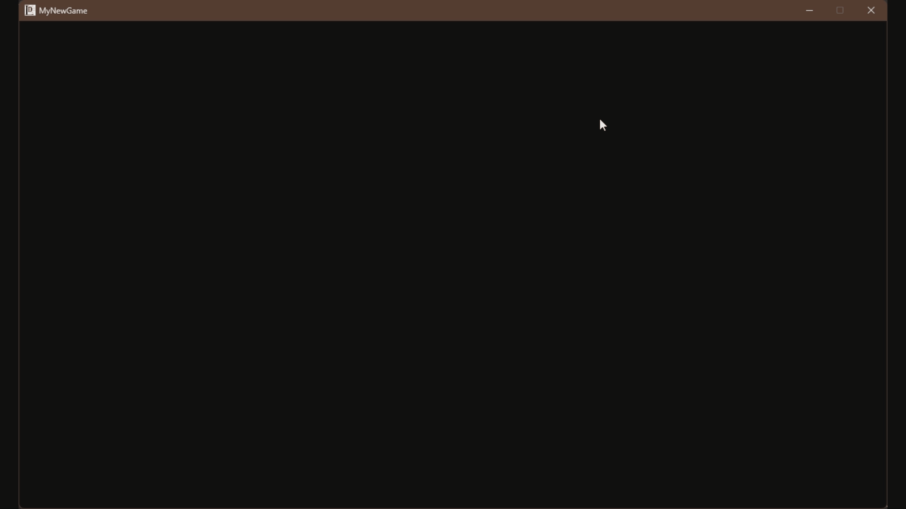
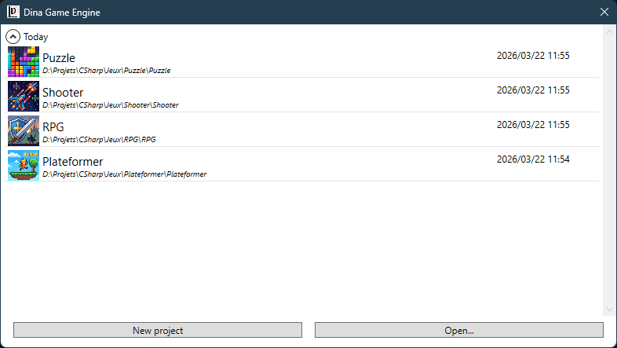
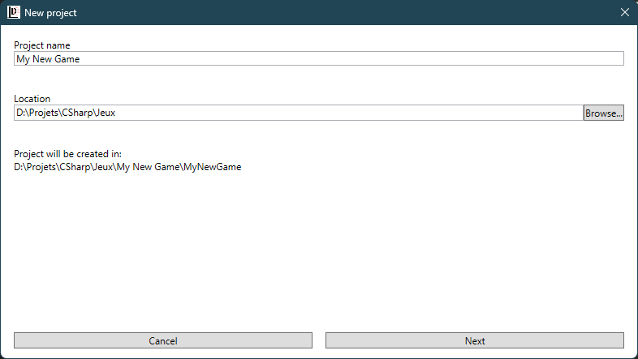
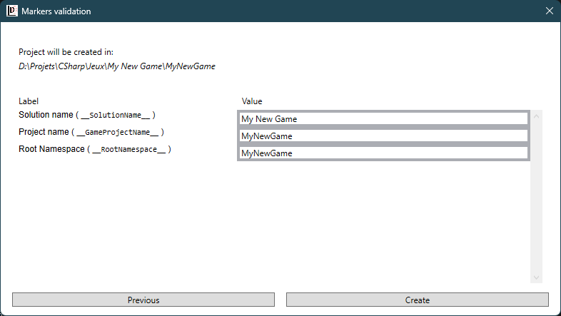
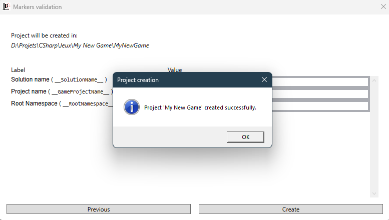
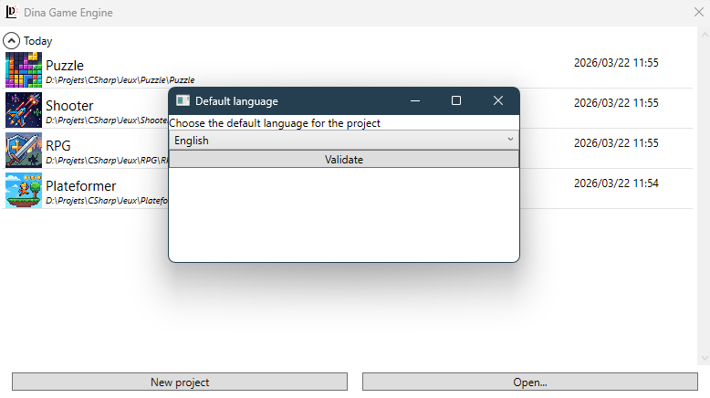
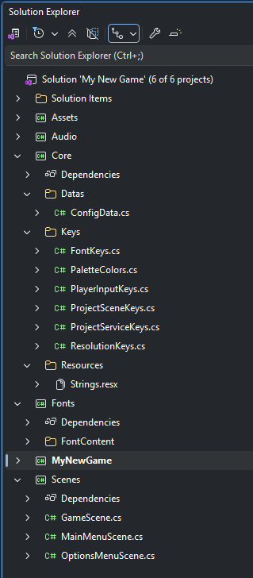
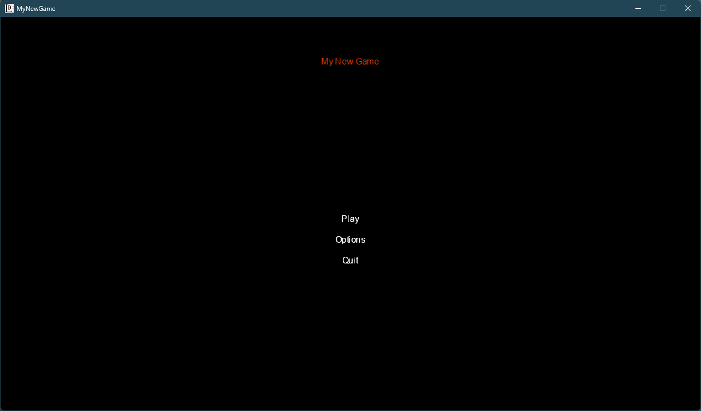

# Dina Game Engine

**A visual 2D game editor for C# developers — powered by MonoGame and DinaCSharp**

---

## What is Dina Game Engine?

Dina Game Engine is a WPF-based visual editor that lets you create and manage 2D games built on [MonoGame](https://www.monogame.net/) and the [DinaCSharp](https://github.com/Asthegor/DinaCSharp) framework.

The goal is simple: **get a fully functional game project up and running in seconds**, without manually setting up solutions, projects, or boilerplate code. The engine generates clean, readable C# code that you can open, understand, and extend in Visual Studio — no black boxes, no locked files.

> Dina Game Engine is designed for **C# developers new to MonoGame** who want a solid starting point without spending hours on project configuration.

---

## ✨ Features

- **One-click project creation** — generates a complete, ready-to-run Visual Studio solution built on MonoGame and DinaCSharp
- **Automatic code generation** — `Designer.cs` files managed by the engine, `.cs` files yours to edit
- **Built-in main menu and options screen** — functional from day one
- **Automatic DinaCSharp integration** — the engine handles the framework dependency for you
- **Localization support** — multi-language projects out of the box
- **Recent projects list** — with pinning, grouping by date, and custom icons
- **Partial class architecture** — engine code and user code clearly separated, never overwritten

---

## 🎬 See it in action

> From zero to a running game in seconds.

---

## 🚀 Getting Started

### Prerequisites

- [Visual Studio 2022](https://visualstudio.microsoft.com/) or later
- [.NET 10 SDK](https://dotnet.microsoft.com/download)
- [MonoGame extension for Visual Studio](https://docs.monogame.net/articles/getting_started/1_setting_up_your_development_environment_windows.html)

### Installation

1. Download the latest release from [GitHub Releases](https://github.com/Asthegor/DinaGameEngine/releases)
2. Extract the archive and run `DinaGameEngine.exe`
3. That's it — DinaCSharp is bundled and managed automatically

### Creating your first project

**Step 1** — Launch Dina Game Engine

**Step 2** — Click **New project**, enter a name and location

**Step 3** — Validate or customize the generated identifiers

**Step 4** — Click **Create** — your project is ready

**Step 5** — Choose your default language

**Step 6** — Open the solution in Visual Studio

**Step 7** — Build and run — your game is already working

---

## 📁 Project Structure

Every generated project contains 6 sub-projects:

| Project | Description |
|---|---|
| `Core` | Keys, configuration data, and localization strings |
| `Fonts` | SpriteFont files for all supported resolutions |
| `Audio` | Audio content (music and sound effects) |
| `Assets` | Graphic assets (textures, sprites) |
| `Scenes` | All game scenes |
| `[YourGame]` | Main game project — your entry point |

All projects reference `DinaCSharp.dll`, which is placed at the solution root and managed by the engine.

---

## 🗺️ Roadmap

The following features are planned for upcoming releases:

- **Add scene** — create and register new game scenes directly from the editor
- **Add font** — add new SpriteFont files with custom resolution variants
- **Text component** — place and configure text elements in a scene visually
- **UI components** — Button, Checkbox, Slider support

---

## 🤝 Contributing

Contributions, bug reports, and feature suggestions are welcome. Please open an issue or submit a pull request on GitHub.

---

## 📄 License

This project is licensed under the MIT License — see the [LICENSE](LICENSE) file for details.

---

Built with ❤️ using C#, WPF, MonoGame and DinaCSharp 
Ce projet est développé par un développeur francophone — les issues en français sont les bienvenues.

