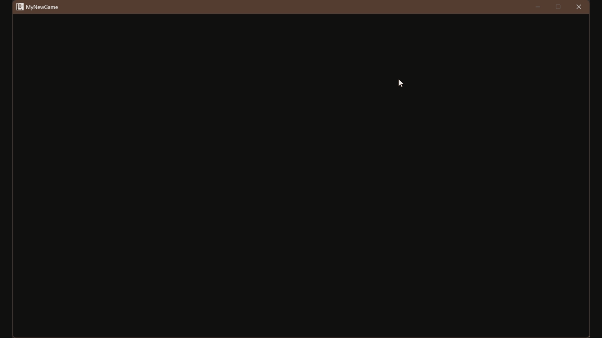

<div align="center">


# Dina Game Engine

**A visual 2D game editor for C# developers — powered by MonoGame and DinaCSharp**

[](LICENSE)
[](https://dotnet.microsoft.com/)
[](https://www.monogame.net/)
[](https://github.com/Asthegor/DinaGameEngine/releases)

</div>

---

## What is Dina Game Engine?

Dina Game Engine is a WPF-based visual editor that lets you create and manage 2D games built on [MonoGame](https://www.monogame.net/) and the [DinaCSharp](https://dinacsharp.lacombedominique.com) framework.

The goal is simple: **get a fully functional game project up and running in seconds**, without manually setting up solutions, projects, or boilerplate code. The engine generates clean, readable C# code that you can open, understand, and extend in Visual Studio — no black boxes, no locked files.

> Dina Game Engine is designed for **C# developers new to MonoGame** who want a solid starting point without spending hours on project configuration.

---

## ✨ Features

- **One-click project creation** — generates a complete, ready-to-run Visual Studio solution built on MonoGame and DinaCSharp
- **Automatic code generation** — `Designer.cs` files managed by the engine, `.cs` files yours to edit
- **Built-in main menu and options screen** — functional from day one
- **Configurable menu actions** — change colors or switch scenes from a menu item without writing code
- **Automatic DinaCSharp updates** — the engine checks and updates the framework DLLs at startup
- **Startup scene selection** — pick which scene launches first, directly from the project home screen
- **Color palette and font management** — defined once in the editor, available everywhere in code
- **Localization support** — multi-language projects out of the box (14 languages)
- **Recent projects list** — with pinning, grouping by date, and context menu
- **Partial class architecture** — engine code and user code clearly separated

---

## 🎬 See it in action

> From zero to a running game in seconds.



---

## 🚀 Getting Started

### Prerequisites

- Windows (the editor is a WPF application)
- [Visual Studio 2022](https://visualstudio.microsoft.com/) or later
- [.NET 10 SDK](https://dotnet.microsoft.com/download)
- [MonoGame extension for Visual Studio](https://docs.monogame.net/articles/getting_started/1_setting_up_your_development_environment_windows.html)

### Installation

1. Download the latest release from [GitHub Releases](https://github.com/Asthegor/DinaGameEngine/releases)
2. Extract the archive and run `DinaGameEngine.exe`
3. Create your first project — the editor handles the rest

---

## 🗂️ Generated Project Structure

Every project Dina creates is a standard, fully buildable Visual Studio solution:

```
MyGame/
├── MyGame.slnx
├── DinaCSharp.dll          ← framework, bundled automatically
├── DinaCSharp.xml          ← IntelliSense documentation
├── MyGame.Core/            ← keys, enums, palette colors, shared constants
├── MyGame.Assets/          ← textures, sprites, sounds, etc.
├── MyGame.Scenes/          ← scene classes (Designer.cs + user .cs pairs)
└── MyGame/                 ← main game entry point
```

The partial class pattern keeps generated code and your code cleanly separated:

```csharp
// MyScene.Designer.cs — managed by the engine, never edit manually
// MyScene.cs          — yours; your code is never deleted

partial void OnLoad()                      { }
partial void OnReset()                     { }
partial void OnUpdate(GameTime gameTime)   { }
partial void OnDraw(SpriteBatch spriteBatch) { }
```

---

## 🧩 Components

Components are added to scenes through the editor. Each one generates the corresponding C# code immediately.

### Text

Display static or dynamic text in a scene.

| Property | Description |
|---|---|
| Font | Chosen from the project's font library |
| Content | The text string (localization key or literal) |
| Color | Named color from the project palette |
| Position | World position (X, Y) |
| Dimensions | Optional bounding box |
| Alignment | Horizontal and vertical |
| Rotation | Rotation of the text |
| Z-Order | Rendering layer |
| Visibility | Show/hide at load |

### ShadowText

Same as **Text**, with a drop shadow.

| Property | Description |
|---|---|
| *(all Text properties)* | See above |
| Shadow Color | Named color from the project palette |
| Shadow Offset | Shadow displacement (X, Y) |

### MenuManager

A full-featured interactive menu system.

**Menu-level properties:** item spacing, direction (vertical/horizontal), action key bindings, icon support (left/right icons with alignment, spacing, resizing and visibility), and a **Cancel** event with its own actions.

**Titles** — decorative header text above the menu:

| Property | Description |
|---|---|
| Font, Content, Color | Standard text appearance |
| Position | Explicit position or centered via `CenterTitles` |
| Alignment | Horizontal and vertical |
| Shadow | Optional drop shadow with separate color and offset |
| Z-Order, Visibility | Rendering control |

**Items** — interactive menu entries:

| Property | Description |
|---|---|
| Font, Content, Color | Standard text appearance |
| State | `Enable` / `Disable` |
| Position, Dimensions | Layout control |
| Alignment | Horizontal and vertical |
| Z-Order, Visibility | Rendering control |

Titles and items can be reordered (move up / move down) directly in the editor.

#### Menu actions

Each menu event is edited as an ordered list of actions (add, remove, reorder). The action system is typed and closed — no arbitrary code is stored in the project file, so sharing a project is safe.

| Event | Scope | Available actions |
|---|---|---|
| Selection | Per item | `ChangeColor` |
| Deselection | Per item | `ChangeColor` |
| Activation | Per item | `ChangeScene` |
| Cancel | Per menu | `ChangeScene` |

A **shared selection/deselection** option generates a single pair of selection/deselection methods used by every item.

For anything the actions don't cover yet, the engine also generates partial callback methods ready to implement:

```csharp
// MyScene.cs
partial MenuItem OnMyMenuItemSelection(MenuItem item)   { return item; }
partial MenuItem OnMyMenuItemDeselection(MenuItem item) { return item; }
partial MenuItem OnMyMenuItemActivation(MenuItem item)  { return item; }
```

The menu's Cancel event gets its own `OnXxxCancellation` partial method.

---

## 🎨 Color System

Colors are defined once in the editor as a named palette (`PaletteColors` class) and referenced by key throughout the project. Changing a color in the editor updates every component that uses it.

---

## 🔤 Font Management

Add a TrueType font to the project and the engine automatically generates SpriteFont definitions at five resolutions (720p, 900p, 1080p, 1440p, 2160p — proportionally scaled from 1080p). All fonts are accessible in code via the generated `FontKeys` class. Roboto is bundled so a new project works without any font setup.

---

## 🏗️ Architecture

### Code generation

Each component type has its own generator deriving from the abstract `ComponentGenerator` class, registered in an `IComponentGeneratorRegistry`. Component types are handled independently of one another.

File modifications use a **zone marker system** (`SectionParser`) that surgically inserts and removes code within named regions, making updates safe and idempotent.

Scene `Designer.cs` files are fully regenerated on each change to guarantee that field declarations, load calls, update calls, and draw calls always appear in the correct order.

When a change removes a partial method that contains user code (e.g. toggling shared selection/deselection), the code is **commented out and kept** in the user file instead of being deleted. Empty generated stubs are removed without a trace.

### Partial class system

| File | Owner | Rule |
|---|---|---|
| `MyScene.Designer.cs` | Engine | Regenerated automatically — never edit |
| `MyScene.cs` | Developer | Your code is never deleted. The engine only updates the MenuManager partial methods, comments out item methods containing code when switching to shared selection/deselection, and refreshes the list of available fields in the header comment |

### Dependency injection

Manual constructor injection throughout — no third-party DI framework.

---

## 🗺️ Roadmap

- [ ] Image and audio components
- [ ] Button component
- [ ] Live scene preview in the editor

---

## 📄 License

MIT — see [LICENSE](LICENSE) for details.

---

## 👤 Author

**Dominique Lacombe** — solo developer, Montreal.  
Coding since age 9. Building tools I wish had existed when I started.

- Site: [lacombedominique.com](https://lacombedominique.com)
- DinaCSharp: [dinacsharp.lacombedominique.com](https://dinacsharp.lacombedominique.com)
